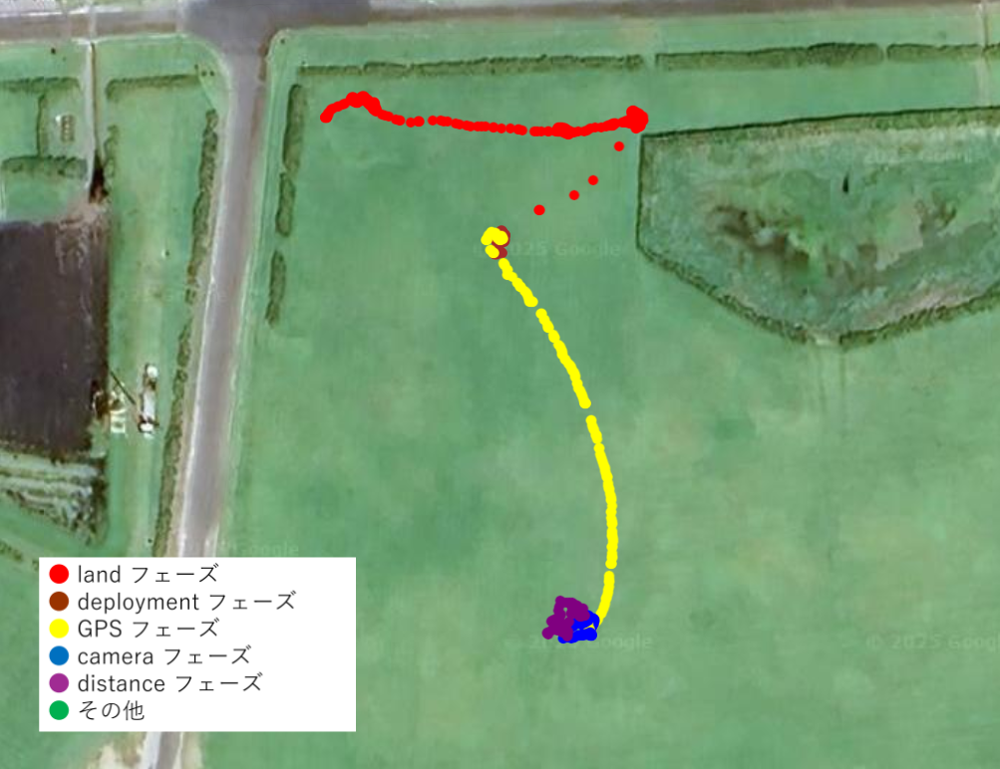

# GPS data plot using Google Maps API
## Overview

This project visualizes GPS data using the Google Maps API. The data is sourced from a CSV file and plotted on a map to provide a visual representation of the recorded locations and movements.

## Data Source

The data is stored in a CSV file located at `public/data.csv`. The file contains the following columns:
- `comment`: Descriptive text about the data point.
- `time`: Timestamp of the data point.
- `phase`: The phase of the operation (e.g., land).
- `baro`: Barometric pressure reading.
- `latitude`: Latitude coordinate.
- `longitude`: Longitude coordinate.
- `duty_R`: Right duty cycle (not used in visualization).
- `duty_L`: Left duty cycle (not used in visualization).
- `theta`: Angle measurement (not used in visualization).
- `cornangle`: Corner angle (not used in visualization).
- `distance`: Distance measurement (not used in visualization).
- `acc_x`, `acc_y`, `acc_z`: Acceleration readings in x, y, and z axes (not used in visualization).
- `rotor_steps`: Rotor steps (not used in visualization).

## Usage

To visualize the data:
1. Ensure you have access to the Google Maps API.
2. Load the `public/data.csv` file.
3. Use the provided script to parse the CSV and plot the data on a Google Map.

## Requirements

- Google Maps API key.
- A web server to host the HTML and JavaScript files.
- A modern web browser to view the map.

## Installation

1. Clone the repository.
2. Place your Google Maps API key in the appropriate location in the script.
3. Start your web server and navigate to the project directory.
4. Open the `index.html` file in your browser to view the map.

## Contributing

Contributions are welcome! Please fork the repository and submit a pull request with your changes.

## License

This project is licensed under the MIT License. See the `LICENSE` file for more details.
